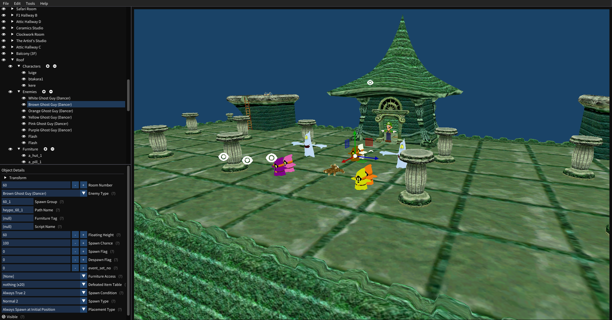

## Booldozer
<p align="center">
</img>
</p>

Booldozer is a work-in-progress editor for the original [Luigi's Mansion on GameCube](https://en.wikipedia.org/wiki/Luigi%27s_Mansion), written by SpaceCats ([@kittensandals](https://twitter.com/kittensandals)) and Gamma ([@SageOfMirrors](https://twitter.com/SageOfMirrors)). It aims to cover as many aspects of modding the game as possible.



## Build Instructions

### Cloning the Repository

```
git clone https://github.com/Sage-of-Mirrors/Booldozer.git

cd Booldozer

git submodule update --init --recursive
```

### Linux

Ensure all required packages are installed (Iconv, libpng, zlib)

```
cmake -S . -B build
cd build
make
```

### Windows

Open the repository in Visual Studio as a CMake Project and compile like any other VS Project.

**Must** be a version of VS that includes vcpkg.

<p align="center">
</img>
</p>
